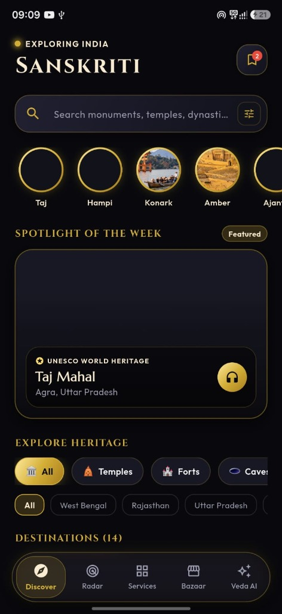
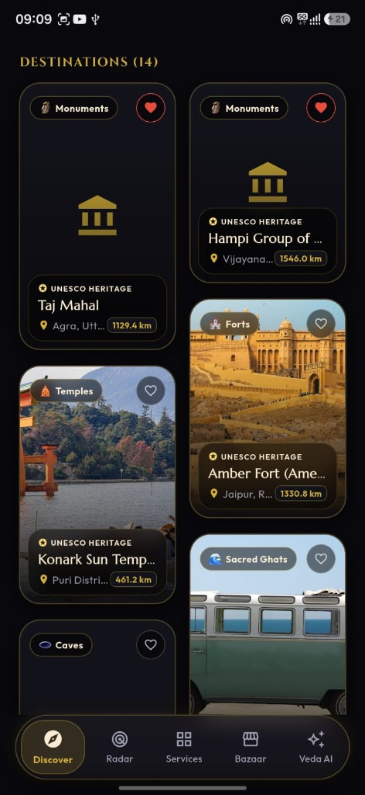
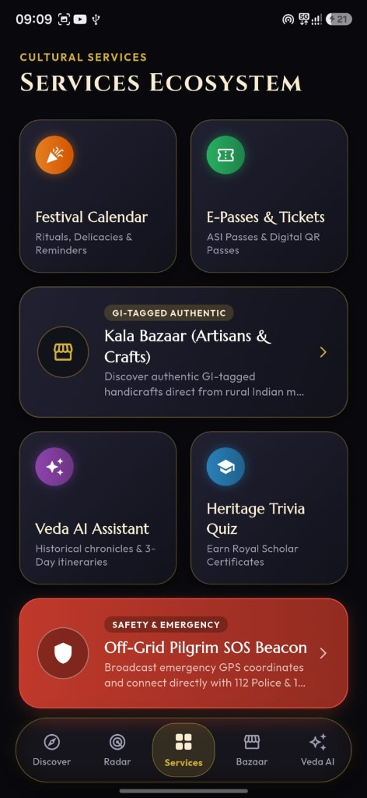
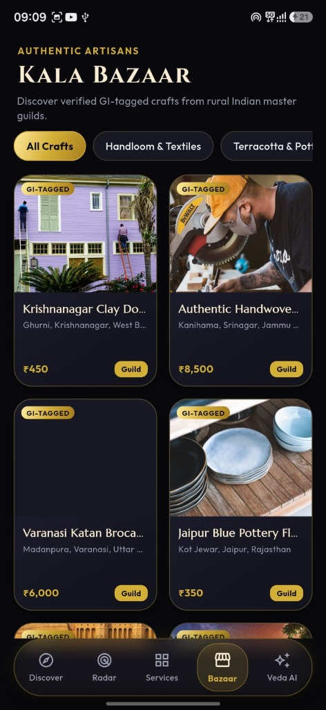
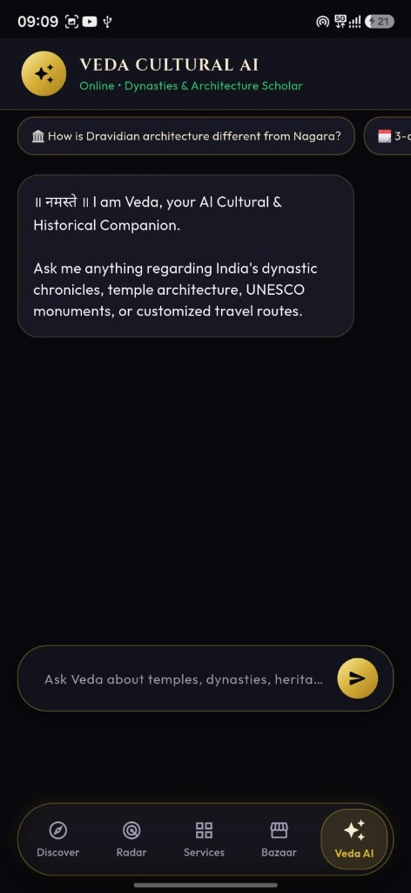

# 🛕 SANSKRITI (संस्कृति) — Next-Generation Cultural Tourism & Civilizational Heritage Ecosystem

<div align="center">

[](SIH_PITCH_DECK.md)
[](#)
[](https://flutter.dev)
[](https://dart.dev)
[](#-sovereign-tech-stack)
[](#-kala-bazaar--ondc-direct-artisan-guilds)
[](#-sanskriti-yatra--gamified-national-cultural-passport)
[](#-veda-cultural-ai-companion--ai-heritage-lens)

**A sovereign, grand-finale-grade digital ecosystem bridging 5,000 years of Indian civilizational heritage with modern spatial computing, sovereign artificial intelligence (Bhashini NLTM & Gemini 1.5 Flash), fair-trade artisan commerce (ONDC), blockchain provenance (Polygon PoS), and offline pilgrim safety.**

[Problem & Solution](#-1-what-problem-we-are-solving) • [How It Works](#-2-proposed-solution--how-it-works) • [Key Innovations](#-3-what-makes-our-solution-innovative) • [Technical Architecture](#-4-technical-overview--system-architecture) • [Screenshots](#-5-app-screenshots--visual-showcase) • [National Alignment](#-6-sovereign-national-alignment) • [Getting Started](#-7-getting-started--verification)

</div>

---

## 📌 Executive Summary (Smart India Hackathon 2026)

* **Problem Statement ID**: 26197
* **Problem Statement Title**: Student Innovation — Ideas that showcase the rich cultural heritage and traditions of India
* **Organization**: AICTE / MIC (Ministry of Education's Innovation Cell)
* **Theme**: Heritage & Culture | **Category**: Software
* **Project Name**: **SANSKRITI (संस्कृति)** — Next-Generation Cultural Tourism & Civilizational Heritage Ecosystem

---

## ❗ 1. What Problem We Are Solving

India is home to the world's oldest continuous civilization: 42 UNESCO World Heritage sites, millions of sacred temples, 8 classical dance traditions, and over 7 million traditional master artisans. However, exploring and preserving this civilizational wealth faces **5 critical breakdowns**:

1. **Fragmented & Commercialized Cultural Chronicles**: Accurate historical data, dynastic lineages, and architectural paradigms (*Nagara, Dravidian, Vesara*) are scattered across disjointed commercial blogs without authentic Indian Knowledge Systems (IKS) validation.
2. **Neglect of Intangible Cultural Heritage (ICH)**: Living traditions (Vedic acoustic chanting, classical dance mudras, martial disciplines like Kalaripayattu, ancient metallurgy) lack engaging interactive digital preservation.
3. **Exploitation of Rural Master Artisans**: Middlemen capture up to 70% of craft revenues, while tourists are scammed with counterfeit machine-made replicas of Geographical Indication (GI) tagged crafts.
4. **Lack of Visual & Spatial Immersion for Youth**: Gen-Z travelers and international tourists find static museum placards uninspiring without 3D spatial models or Augmented Reality time-travel reconstruction.
5. **Zero-Connectivity Safety Hazards in Remote Sites**: High-risk remote rock-cut caves, ghats, and high-altitude pilgrimage routes experience complete cellular blackout during emergencies, leaving travelers stranded.

---

## 💡 2. Proposed Solution & How It Works

**Sanskriti** solves these challenges through a unified, high-performance mobile application engineered with a **Royal Obsidian (`#0C0C10`) & Imperial Gold (`#D4AF37`)** aesthetic.

```
┌─────────────────────────────────────────────────────────────────────────────────────────────┐
│                                   END-TO-END WORKFLOW                                       │
│                                                                                             │
│  [1. Discover & Map] ──► [2. Spatial 3D / AR] ──► [3. AI Scholar / Lens]                    │
│   • GPS Heritage Radar    • 360° GLB Models        • Bhashini Indic Voice (12+ Langs)       │
│   • PostGIS 25m Audio     • Kaalchakra AR Shader   • Gemini 1.5 Flash Vision Scanner        │
│                                                            │                                │
│                                                            ▼                                │
│  [5. Off-Grid Safety] ◄── [4. ONDC Commerce & Passport] ◄──┘                                │
│   • 100% Offline Hive      • Kala Bazaar ONDC Seller Node                                   │
│   • SMS Relay to 112/1363  • Polygon PoS Soulbound Passport & GI Seals                      │
└─────────────────────────────────────────────────────────────────────────────────────────────┘
```

### Step-by-Step Technical Workflow:
1. **Heritage Discovery & Geospatial Radar**: The app computes real-time geodetic distances to nearby monuments using `geolocator` and PostgreSQL PostGIS spatial indexing (`ST_DWithin`). When a traveler enters within a 25-meter radius of an architectural feature, an automated spatial audio tour triggers.
2. **3D Spatial Exploration & Kaalchakra Time-Travel**: Users inspect lightweight (`<5MB`) 3D GLB wireframes of monuments (Konark Sun Temple, Kailash Temple, Hampi Chariot). Through Google ARCore, a dual-mesh alpha-blending shader lets travelers swipe a temporal slider to watch ancient ruins morph back into their 12th-century restored state in real-time AR.
3. **Sovereign Indic Voice & AI Heritage Lens**:
   - **Bhashini NLTM API**: Delivers real-time Speech-to-Text (ASR), Neural Machine Translation (NMT), and Text-to-Speech (TTS) in 12+ Indic languages (Hindi, Bengali, Tamil, Telugu, Marathi, Gujarati, etc.).
   - **AI Heritage Lens (Gemini 1.5 Flash)**: Sub-second multimodal vision analysis of camera frames, identifying dynasty, architectural school, lost-wax casting methods, and dance mudras with structured JSON outputs.
4. **Kala Bazaar (ONDC Seller Node) & Polygon Provenance**: Connects travelers directly with verified rural artisan cooperatives (Krishnanagar Clay Dolls, Varanasi Silk, Thanjavur Gold Foil). Each craft and cultural passport stamp is minted as a zero-gas Soulbound NFT on the Polygon (PoS) blockchain.
5. **Offline Resiliency & Emergency SOS Beacon**: In zero-connectivity heritage sites, the app operates 100% offline via Hive local document storage. If an emergency occurs, the app grabs hardware GPS coordinates and dispatches background SMS telemetry directly to **112** (Police Emergency) and **1363** (Incredible India Tourist Helpline).

---

## 🚀 3. What Makes Our Solution Innovative?

| Innovation Pillar | Traditional Approaches | SANSKRITI's Sovereign Innovation |
| :--- | :--- | :--- |
| **Kaalchakra AR Time-Travel** | Static 2D photographs of ruins | **Dual-mesh temporal alpha-blending shader** displaying ruined state ⇄ 12th Century restored state in real-time AR. |
| **Sovereign Indic Voice AI** | English-only or robotic audio guides | Government of India's **Bhashini NLTM API** providing dialectical speech in 12+ Indic languages. |
| **Sub-Second AI Heritage Lens** | Generic reverse-image web search | **Google Gemini 1.5 Flash Vision** with strict JSON Schema output identifying sculptures, dynasties, and mudras in `<800ms`. |
| **Fair-Trade Artisan Commerce** | 70% middleman revenue extraction | **ONDC Seller Node protocol integration** giving 100% direct revenue to verified rural artisan cooperatives. |
| **Tamper-Proof GI Provenance** | Easily counterfeited paper certificates | **Polygon (PoS) Soulbound token contracts (ERC-5192 / ERC-1155)** guaranteeing immutable artisan craft provenance. |
| **Zero-Connectivity Pilgrim SOS** | Fails completely without mobile internet | **Offline-first GPS grabber + background SMS telemetry** relaying distress coordinates to 112 & 1363 without data. |

---

## 🛠️ 4. Technical Overview & System Architecture

### Multi-Tier Sovereign System Architecture:
```
┌──────────────────────────────────────────────────────────────────────────────────────────────┐
│                      LAYER 1: CLIENT & SPATIAL INTERACTION LAYER                             │
│   Flutter 3.44+ (Dart 3.0+) • Royal Obsidian (#0C0C10) & Imperial Gold (#D4AF37) Design      │
│                                                                                              │
│   ┌──────────────────────┐  ┌──────────────────────┐  ┌──────────────────────────────────┐  │
│   │ 3D Spatial Viewer    │  │ Kaalchakra AR Engine │  │ Heritage Radar & GIS Mapper      │  │
│   │  • model_viewer_plus │  │  • Google ARCore     │  │  • flutter_map + latlong2        │  │
│   │  • <5MB GLB Models   │  │  • Dual-Mesh Shaders │  │  • Mappls / CartoDB Dark Matter  │  │
│   │  • 360° Inspection   │  │  • 12th Century Blend│  │  • 25m Geo-fence Proximity Audio │  │
│   └──────────┬───────────┘  └──────────┬───────────┘  └────────────────┬─────────────────┘  │
 └──────────────┼─────────────────────────┼───────────────────────────────┼─────────────────────┘
                │                         │                               │
                ▼                         ▼                               ▼
 ┌──────────────────────────────────────────────────────────────────────────────────────────────┐
│                      LAYER 2: SOVEREIGN AI & INDIC SCHOLAR PIPELINE                          │
│                                                                                              │
│   ┌───────────────────────────────────────────────┐ ┌────────────────────────────────────┐   │
│   │ 🗣️ Bhashini API (NLTM / MeitY)                │ │ 👁️ Google Gemini 1.5 Flash Vision  │   │
│   │  • Automatic Speech Recognition (ASR / STT)   │ │  • Zero-shot Multi-modal Inference │   │
│   │  • Neural Machine Translation (NMT)           │ │  • Structured JSON Output Schema   │   │
│   │  • Text-to-Speech Synthesis (TTS)             │ │  • Frieze, Dynasty, Mudra Recog.   │   │
│   │  • 12+ Official Indic Languages Supported     │ │  • Sub-second Latency (<800ms)     │   │
│   └──────────────────────┬────────────────────────┘ └─────────────────┬──────────────────┘   │
│                          │                                            │                      │
│                          ▼                                            ▼                      │
│   ┌──────────────────────────────────────────────────────────────────────────────────────┐   │
│   │ 🧠 Conversational Scholar RAG: LangChain / LlamaIndex + Qdrant / pgvector Vector DB  │   │
│   │  • ASI Monograph Index • NCERT Indian Knowledge Systems (IKS) • Temple Blueprints    │   │
│   └──────────────────────────────────────────────────────────────────────────────────────┘   │
 └──────────────────────────────────────────────┬───────────────────────────────────────────────┘
                                                │
                                                ▼
 ┌──────────────────────────────────────────────────────────────────────────────────────────────┐
│                      LAYER 3: GEOSPATIAL & CLOUD BACKEND LAYER                               │
│                                                                                              │
│   ┌─────────────────────────────────────────────────┐ ┌──────────────────────────────────┐   │
│   │ 🐘 PostgreSQL 16 + PostGIS Spatial Engine       │ │ 🛰️ Telemetry & Trigger Engine     │   │
│   │  • ST_DWithin(geom, user_loc, 25) Proximity     │ │  • Auto Audio Tour Trigger       │   │
│   │  • Spatial Indexing (GIST) for 4,000+ Monuments │ │  • Crowd Density Monitoring      │   │
│   └─────────────────────────────────────────────────┘ └──────────────────────────────────┘   │
 └──────────────────────────────────────────────┬───────────────────────────────────────────────┘
                                                │
                                                ▼
 ┌──────────────────────────────────────────────────────────────────────────────────────────────┐
│                      LAYER 4: COMMERCE & SOVEREIGN PROVENANCE GUILD                          │
│                                                                                              │
│   ┌───────────────────────────────────────────────┐ ┌────────────────────────────────────┐   │
│   │ 🛍️ ONDC Seller Node (Kala Bazaar 2.0)         │ │ 🔗 Polygon (PoS) Blockchain Node   │   │
│   │  • Beckn Protocol Gateway Integration         │ │  • ERC-5192 Soulbound Passport     │   │
│   │  • Direct Rural Artisan Guild Settlement      │ │  • ERC-1155 GI-Tag Provenance Seals│   │
│   │  • 0% Middleman Exploitation Rails            │ │  • Zero-Gas Meta-Transactions      │   │
│   └───────────────────────────────────────────────┘ └────────────────────────────────────┘   │
 └──────────────────────────────────────────────┬───────────────────────────────────────────────┘
                                                │
                                                ▼
 ┌──────────────────────────────────────────────────────────────────────────────────────────────┐
│                      LAYER 5: OFFLINE-FIRST RESILIENCY & PILGRIM SOS ENGINE                  │
│                                                                                              │
│   ┌───────────────────────────────────────────────┐ ┌────────────────────────────────────┐   │
│   │ 📦 Hive Embedded Local Document Database      │ │ 🚨 Offline SMS Telephony Relay     │   │
│   │  • 100% Offline Monument Chronicles           │ │  • Background GPS Coordinate Grab  │   │
│   │  • Cached Vector Embeddings & Audio Tours     │ │  • Fallback SMS to 112 (Police)    │   │
│   │  • Local Vector Cache for Zero-Signal Sites   │ │  • Fallback SMS to 1363 (Tourism)  │   │
│   └───────────────────────────────────────────────┘ └────────────────────────────────────┘   │
 └──────────────────────────────────────────────────────────────────────────────────────────────┘
```

### Complete Technology Stack:
* **Frontend Application**: Flutter 3.44+ / Dart 3.0+ (Cross-Platform Android, iOS, Web, Desktop).
* **UI Design Architecture**: Royal Obsidian (`#0C0C10`) & Imperial Gold (`#D4AF37`) with Google Fonts (Cinzel / Outfit).
* **3D Spatial & AR**: `model_viewer_plus: ^1.7.0` (glTF/GLB models `<5MB`) + Google ARCore.
* **Indic Voice AI**: Bhashini ULCA API (Government of India / MeitY).
* **Multimodal Vision AI**: Google Gemini 1.5 Flash API (`response_mime_type: "application/json"`).
* **Mapping & GIS**: `flutter_map: ^6.1.0`, `latlong2: ^0.9.0`, PostgreSQL 16 + PostGIS (`ST_DWithin`).
* **Commerce & Web3**: Open Network for Digital Commerce (ONDC Beckn Protocol) + Polygon PoS Testnet (ERC-5192 & ERC-1155).
* **Offline Storage & Safety**: `hive_flutter: ^1.1.0`, `url_launcher: ^6.3.0`, `geolocator: ^14.0.3`.

### Repository Structure:
```
sanskriti/
├── lib/
│   ├── main.dart                      # App entry point, theme initialization & route registration
│   ├── app_theme.dart                 # Obsidian (#0C0C10) & Imperial Gold (#D4AF37) Design System
│   ├── models/
│   │   ├── heritage_place.dart        # Monument data model (Dynasty, Era, Audio, GPS, 3D Assets)
│   │   ├── tradition.dart             # Intangible Cultural Heritage model (Dances, Mudras, Chants)
│   │   ├── festival.dart              # Festival timeline & Sacred Bhog delicacy data model
│   │   ├── craft_item.dart            # Kala Bazaar GI-tagged artisan craft model
│   │   ├── ticket_booking.dart        # Digital ASI E-Pass booking model with cryptographic QR
│   │   └── quiz_question.dart         # Cultural trivia questions & architectural explanations
│   ├── data/
│   │   ├── heritage_repository.dart   # 16+ Curated Indian heritage monuments
│   │   ├── traditions_repository.dart # Intangible Cultural Heritage repository
│   │   ├── festival_repository.dart   # Indian festival calendar & ritual timelines
│   │   ├── kala_bazaar_repository.dart# Authentic GI-tagged craft & guild repository
│   │   └── quiz_repository.dart       # Cultural trivia questions repository
│   ├── services/
│   │   ├── bhashini_service.dart      # Government of India Bhashini ULCA API bridge (ASR/NMT/TTS)
│   │   ├── heritage_lens_service.dart # Google Gemini 1.5 Flash multimodal vision artifact scanner
│   │   ├── offline_sos_service.dart   # Zero-connectivity GPS grabber & emergency SMS dispatcher (112/1363)
│   │   ├── location_service.dart      # Geolocator GPS proximity & geodetic distance calculations
│   │   ├── audio_service.dart         # Audio tour guide state manager & waveform controller
│   │   ├── ai_heritage_service.dart   # Veda AI 2.0 multilingual conversational scholar
│   │   └── favorites_service.dart     # Bookmarks and saved destinations manager
│   ├── screens/
│   │   ├── splash_screen.dart         # Royal animated splash screen with Vedic shloka
│   │   ├── main_navigation.dart       # 5-Tab persistent navigation bar with quick SOS beacon
│   │   ├── home_screen.dart           # Discover page with stories, search, spotlight & masonry grid
│   │   ├── details_screen.dart        # Deep historical chronicles, audio guides & architectural hotspots
│   │   ├── map_screen.dart            # Heritage Radar interactive dark CartoDB & Mappls tile map
│   │   ├── services_screen.dart       # Cultural Services Ecosystem Bento Grid
│   │   ├── parampara_screen.dart      # Living traditions vault, 8 classical dances & Vedic chants
│   │   ├── spatial_viewer_screen.dart # 3D spatial models & Kaalchakra time-travel restoration slider
│   │   ├── heritage_passport_screen.dart # Sanskriti Yatra Cultural Passport & Polygon certificates
│   │   ├── kala_bazaar_screen.dart    # GI-tagged fair-trade marketplace (ONDC seller node)
│   │   ├── ticket_booking_screen.dart # Digital ASI Monument E-Pass booking simulator with QR codes
│   │   ├── ai_assistant_screen.dart   # Veda Cultural AI & AI Heritage Lens scanner interface
│   │   ├── festival_calendar_screen.dart # Chronological festival timeline, rituals & delicacies
│   │   ├── quiz_screen.dart           # Interactive heritage trivia game with real-time scoring
│   │   └── favorites_screen.dart      # Saved monuments & custom travel bookmarks
│   └── widgets/
│       ├── heritage_card.dart         # Staggered masonry monument card with UNESCO badge
│       ├── audio_guide_bottom_sheet.dart # Waveform audio player modal with speed controls
│       └── sos_dialog.dart            # Off-Grid emergency SOS beacon dialog wired to OfflineSosService
└── test/
    └── widget_test.dart               # 16 automated unit and widget test suites (100% Passing)
```

---

## 📱 5. App Screenshots & Visual Showcase

<div align="center">

| 01. Discover & Home | 02. Destinations Grid | 03. Services Hub |
|:---:|:---:|:---:|
|  |  |  |
| *Spotlight, search, cultural stories & category filters* | *Masonry cards with live GPS proximity calculations* | *Central hub for all cultural services & utilities* |

<br />

| 04. Kala Bazaar (ONDC Artisans) | 05. Veda AI & Heritage Lens |
|:---:|:---:|
|  |  |
| *Verified GI-tagged crafts direct from rural cooperatives* | *Conversational scholar & visual artifact scanner* |

</div>

---

## 🇮🇳 6. Sovereign National Alignment

* **Digital India & India Stack**: Integrated with **Bhashini (National Language Translation Mission)**, **ONDC (Open Network for Digital Commerce)**, and **Mappls (MapmyIndia)**.
* **National Education Policy (NEP 2020)**: Fulfills the mandate for **Indian Knowledge Systems (IKS)** by gamifying heritage learning through the Sanskriti Yatra Cultural Passport.
* **Ministry of Tourism Initiatives**: Aligned with **Dekho Apna Desh**, **PRASHAD Scheme** (Pilgrimage Rejuvenation and Spiritual Heritage Augmentation Drive), and **Swadesh Darshan 2.0**.
* **Vocal for Local & ODOP**: Protects traditional artisans holding authentic Geographical Indication (GI) tags under the One District One Product (ODOP) mission.
* **National Pilgrim Safety Framework**: Directly integrates emergency telemetry with **112 (ERSS)** and **1363 (Incredible India Helpline)**.

---

## 🚀 7. Getting Started & Verification

### 📥 1. Clone & Install Dependencies
```bash
git clone https://github.com/Souvik-Das-23/SANSKRITI.git
cd SANSKRITI/sanskriti
flutter pub get
```

### 🧪 2. Run Automated Verification & Test Suites
```bash
# Static Code Analysis (0 Errors, 0 Warnings, 0 Lints)
flutter analyze

# Execute All 16 Automated Test Suites (100% Passing)
flutter test
```

### ▶️ 3. Launch on Target Platform
```bash
# Run on Android Smartphone / Emulator
flutter run -d android

# Run on Windows Desktop
flutter run -d windows

# Run on Chrome Web Browser
flutter run -d chrome
```

---

## 📄 License & Attribution

This project is licensed under the **MIT License** — see the [LICENSE](LICENSE) file for details.

<div align="center">
<sub>Crafted with passion for Smart India Hackathon (SIH) 2026. 🇮🇳</sub>
</div>
